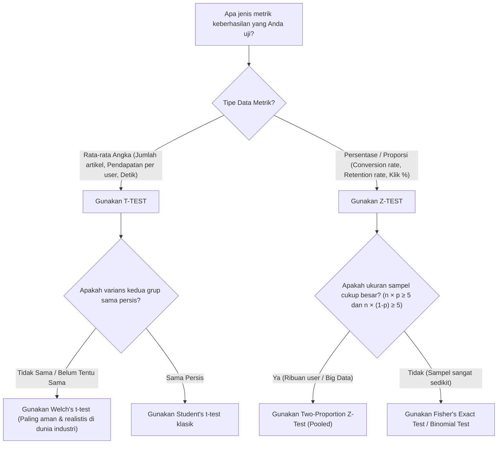

# 🧠 Memahami Matematika Data Science dengan Bahasa Awam
> *Panduan Praktis & Analogi Sehari-hari untuk Business Manager, Product Owner, dan Praktisi Non-Teknis.*

Selamat datang di modul panduan konseptual! Jika Anda pernah merasa pusing melihat simbol matematika seperti $\mu$, $\sigma$, $\int$, atau istilah teknis seperti *p-value*, *degrees of freedom*, dan *cumulative distribution function*, dokumen ini ditulis khusus untuk Anda.

Tujuan dokumen ini adalah **menerjemahkan rumus-rumus rumit menjadi logika bisnis dan analogi akal sehat** yang dapat langsung Anda pahami dan gunakan saat berdiskusi dengan tim teknis maupun klien.

---

## 📑 Daftar Isi
1. [Duel Dua Sahabat Statistik: T-Test vs. Z-Test](#1-duel-dua-sahabat-statistik-t-test-vs-z-test)
   - [Cerita Asal-Usul: Dari Pabrik Bir Guinness ke Ruang Rapat Bisnis](#cerita-asal-usul-dari-pabrik-bir-guinness-ke-ruang-rapat-bisnis)
   - [Perbedaan Mendasar T-Test dan Z-Test](#perbedaan-mendasar-t-test-dan-z-test)
   - [Pohon Keputusan (Decision Tree) Praktis](#pohon-keputusan-decision-tree-praktis)
   - [Analogi Kehidupan Sehari-hari](#analogi-kehidupan-sehari-hari)
2. [Membedah Konsep-Konsep Statistik Kunci](#2-membedah-konsep-konsep-statistik-kunci)
   - [PDF vs. PMF: Apa Bedanya Data Kontinu dan Data Diskrit?](#pdf-vs-pmf-apa-bedanya-data-kontinu-dan-data-diskrit)
   - [CDF dan Inverse CDF: Mengukur Peluang Akumulatif dan Simulasi Data](#cdf-dan-inverse-cdf-mengukur-peluang-akumulatif-dan-simulasi-data)
   - [P-Value: Alat Pengukur "Faktor Kebetulan"](#p-value-alat-pengukur-faktor-kebetulan)
   - [Tingkat Signifikansi ($\alpha$) dan Tingkat Kepercayaan (Confidence Level)](#tingkat-signifikansi-alpha-dan-tingkat-kepercayaan-confidence-level)
   - [Statistical Power ($1 - \beta$) dan Sample Size: Ketajaman Lensa Kamera](#statistical-power-1---beta-dan-sample-size-ketajaman-lensa-kamera)
   - [Degrees of Freedom (Derajat Kebebasan): Fleksibilitas Pilihan](#degrees-of-freedom-derajat-kebebasan-fleksibilitas-pilihan)
3. [Mengapa Proyek Ini Memilih Metode Tertentu?](#3-mengapa-proyek-ini-memilih-metode-tertentu)
   - [Kasus 1: Mengapa Naive Bayes Mengombinasikan Tiga Distribusi Berbeda?](#kasus-1-mengapa-naive-bayes-mengombinasikan-tiga-distribusi-berbeda)
   - [Kasus 2: Mengapa Sistem Rekomendasi Menggunakan Welch's T-Test?](#kasus-2-mengapa-sistem-rekomendasi-menggunakan-welchs-t-test)
   - [Kasus 3: Mengapa Retensi Pengguna Menggunakan Two-Proportion Z-Test?](#kasus-3-mengapa-retensi-pengguna-menggunakan-two-proportion-z-test)
4. [Kamus Singkat: Menerjemahkan Bahasa Statistik ke Bahasa Bisnis](#4-kamus-singkat-menerjemahkan-bahasa-statistik-ke-bahasa-bisnis)

---

## 1. Duel Dua Sahabat Statistik: T-Test vs. Z-Test

Dalam dunia bisnis dan produk digital, kita sering melakukan eksperimen **A/B Testing** untuk membandingkan dua kelompok:
* **Kelompok A (Origin / Kontrol):** Pengalaman pengguna lama (tanpa fitur baru).
* **Kelompok B (Varian / Treatment):** Pengalaman pengguna baru (dengan fitur baru).

Pertanyaan bisnisnya selalu sama: **"Apakah perbedaan hasil antara A dan B ini benar-benar karena fitur baru kita bekerja, atau cuma kebetulan saja?"**

Untuk menjawabnya, kita menggunakan salah satu dari dua uji hipotesis populer: **T-Test** atau **Z-Test**.

### Cerita Asal-Usul: Dari Pabrik Bir Guinness ke Ruang Rapat Bisnis
Tahukah Anda bahwa **T-Test** pertama kali diciptakan di dalam pabrik bir? 

Pada awal abad ke-20, seorang ahli kimia bernama **William Sealy Gosset** bekerja di pabrik bir **Guinness** di Dublin, Irlandia. Tugasnya adalah memastikan kualitas jelai (*barley*) dan rasa bir tetap konsisten. Masalahnya, ia hanya bisa mengambil beberapa sampel tong bir kecil (sampel berukuran kecil) karena jika menguji seluruh tong, birnya akan habis terbuang.

Statistika yang ada saat itu (Z-Test) mensyaratkan sampel yang sangat besar dan pengetahuan pasti tentang seluruh populasi. Gosset kemudian merumuskan metode baru untuk menguji sampel kecil dengan tingkat ketidakpastian yang lebih tinggi, yang kini dikenal sebagai **Student's t-Distribution** (ia memakai nama samaran "Student" karena pabrik bir melarang karyawannya mempublikasikan rahasia dagang).

---

### Perbedaan Mendasar T-Test dan Z-Test

| Aspek Pembanding | T-Test | Z-Test |
| :--- | :--- | :--- |
| **Fokus Pertanyaan Bisnis** | "Apakah **rata-rata nilai** kelompok ini berbeda?" (misal: pengeluaran belanja Rp, durasi menit, jumlah artikel) | "Apakah **persentase/proporsi** kelompok ini berbeda?" (misal: *click-through rate*, *conversion rate*, *churn rate*) |
| **Tipe Data Metrik** | **Kontinu / Numerik** (Angka riil: 4.7 artikel, 12.3 menit, $45.50) | **Biner / Kategorikal** (Ya/Tidak, Klik/Tidak Klik, Langganan/Batal) |
| **Ukuran Sampel ($n$)** | Bagus untuk sampel kecil ($n < 30$), namun sangat fleksibel dan andal untuk sampel besar. | Sangat ideal untuk sampel besar ($n \ge 30$, ratusan hingga ribuan pengguna). |
| **Standar Deviasi Populasi ($\sigma$)** | **Tidak diketahui** (kita menaksirnya dari standar deviasi sampel $s$). | **Diketahui**, atau menggunakan estimasi proporsi dari sampel raksasa via Teorema Limit Pusat (CLT). |
| **Bentuk Kurva Distribusi** | Mirip lonceng, tetapi memiliki **ekor yang lebih tebal (fat tails)** untuk mengakomodasi risiko ketidakpastian sampel. | Berbentuk kurva lonceng normal standar ($N(0,1)$) yang ramping dan presisi. |
| **Rumus yang Digunakan di Proyek Ini** | **Welch's Two-Sample T-Test** (mengantisipasi varians dan ukuran sampel yang berbeda). | **Two-Sample Z-Test for Proportions** (dengan Pooled Proportion $\hat{p}$). |

---

### Pohon Keputusan (Decision Tree) Praktis

Saat Anda merancang pengujian A/B untuk produk digital Anda, gunakan alur berpikir berikut:



---

### Analogi Kehidupan Sehari-hari

#### 1. Analogi T-Test: Mencicipi Sup di Dua Panci Berbeda
> Bayangkan Anda memiliki dua panci sup soto. Panci A dibuat dengan resep lama, Panci B dibuat dengan bumbu kaldu baru. Anda mengambil **3 sendok kuah** dari Panci A dan **3 sendok kuah** dari Panci B. 
> 
> Karena Anda hanya mengambil sedikit sendok (sampel kecil), ada kemungkinan satu sendok kuah kebetulan mengambil gumpalan garam yang belum larut (variasi tinggi). **T-test** dirancang untuk situasi ini: ia sangat berhati-hati dan memperhitungkan ketidakteraturan tersebut sebelum berani menyimpulkan apakah Panci B memang lebih gurih daripada Panci A.

#### 2. Analogi Z-Test: Quick Count Pemilu atau Survei Rasa Minuman Kaleng
> Bayangkan sebuah pabrik minuman ingin tahu: *"Apakah konsumen lebih memilih kemasan Kaleng Biru atau Kaleng Merah?"* Pilihan konsumen di sini bersifat biner: **Pilih Kaleng Biru (1)** atau **Tidak Pilih (0)**.
> 
> Pabrik menanyakan pertanyaan ini kepada **5.000 pembeli** di berbagai supermarket. Karena ukuran datanya sangat besar dan jawabannya berbentuk persentase suara (misalnya: 52% vs 48%), kita menggunakan **Z-test**. Kurva normal bekerja sempurna pada sampel skala besar untuk menghitung apakah keunggulan 4% itu nyata secara statistik.

---

## 2. Membedah Konsep-Konsep Statistik Kunci

### PDF vs. PMF: Apa Bedanya Data Kontinu dan Data Diskrit?

Komputer dan algoritma *Machine Learning* membutuhkan cara untuk memahami bagaimana data tersebar di alam nyata. Di repositori ini, kita menggunakan dua jenis fungsi probabilitas:

```
           DISKRIT (Terhitung)                       KONTINU (Terukur)
      Probability Mass Function (PMF)         Probability Density Function (PDF)
      
          Tinggi Batang = Peluang                 Luas Area di Bawah Kurva = Peluang
               [ 0.4 ]                                       ___
               |     |                                     /     \
               |     |   [ 0.2 ]                          /       \
         [0.1] |     |   |     |                         /  Area   \
           |   |     |   |     |                        /|_________|\
         --+---+-----+---+-----+--                -----+-----------+-----
           0   1     2   3     4                         a         b
```

#### A. PMF (Probability Mass Function) — Khusus Data Diskrit
* **Karakteristik:** Digunakan untuk menghitung data yang berupa bilangan bulat atau hitungan diskrit (tidak ada nilai pecahan koma).
* **Contoh di Repositori:** Fitur `sing_days` (jumlah hari burung berkicau dalam 30 hari). Burung bisa berkicau 10 hari atau 11 hari, tetapi tidak mungkin 10,478 hari.
* **Analogi Awam:** Seperti **anak tangga**. Anda hanya bisa menginjak anak tangga ke-1, ke-2, atau ke-3. Tinggi masing-masing anak tangga menunjukkan langsung seberapa besar peluang kejadian tersebut.

#### B. PDF (Probability Density Function) — Khusus Data Kontinu
* **Karakteristik:** Digunakan untuk data pengukuran fisik yang nilainya bisa berupa bilangan desimal tak terhingga.
* **Contoh di Repositori:** Fitur `wingspan_cm` (lebar sayap: 34.82 cm) dan `weight_g` (berat burung: 20.15 gram).
* **Analogi Awam:** Seperti **lereng bukit yang mulus**. Peluang untuk menemukan seekor burung dengan berat *persis tepat* 20.0000000000 gram adalah nol (karena skala timbangan tak terhingga). Oleh karena itu, kita tidak mengukur titik tunggal, melainkan **kepadatan (luas area)** kemungkinan burung berada di rentang berat 19.5 gram hingga 20.5 gram.

---

### CDF dan Inverse CDF: Mengukur Peluang Akumulatif dan Simulasi Data

#### Apa itu CDF (Cumulative Distribution Function)?
* **Definisi Sederhana:** CDF menjawab pertanyaan akumulatif: *"Berapa peluang nilai acak akan **lebih kecil atau sama dengan** angka tertentu ($X \le x$)?"*
* **Analogi Awam:** Bayangkan Anda sedang berdiri di antrean wahana Dufan. Petugas mengatakan tinggi badan Anda 165 cm. Nilai CDF memberitahu Anda: *"70% dari seluruh pengunjung memiliki tinggi badan sama dengan atau di bawah Anda."* Nilai CDF selalu bergerak naik dari 0 (0%) hingga 1 (100%).

#### Apa itu Inverse CDF (Quantile Function / Percent-Point Function)?
* **Definisi Sederhana:** Kebalikan dari CDF. Anda menentukan persentase targetnya terlebih dahulu, lalu rumus memberitahu berapa nilai angka fisiknya.
* **Analogi Awam:** Jika CDF bertanya: *"Berapa persen orang yang tingginya di bawah 175 cm?"*, maka Inverse CDF bertanya: *"Jika saya ingin berada di 10% orang tertinggi di ruangan ini, berapa batas minimal tinggi badan yang harus saya miliki?"*
* **Penerapan Nyata di Kode:** 
  Pada `notebooks/soal-1-distribusi-dan-algoritma-naive-bayes.ipynb`, kita menggunakan teknik canggih bernama **Inverse Transform Sampling**. Kita menghasilkan angka acak seragam antara 0 dan 1, lalu melemparkannya ke rumus `inverse_cdf` untuk menciptakan ribuan data burung tiruan (*synthetic data*) yang perilakunya identik dengan alam liar!

---

### P-Value: Alat Pengukur "Faktor Kebetulan"

*P-value* (nilai probabilitas) sering kali menjadi istilah paling ditakuti oleh orang non-teknis, padahal maknanya sangat sederhana:

> **P-Value adalah persentase kemungkinan bahwa perbedaan hasil yang Anda lihat hanyalah sebuah KEBETULAN BELAKA (faktor keberuntungan/noise acak).**

#### Analogi Melempar Koin:
* Anda melempar koin 10 kali. Hasilnya: 6 kali Gambar, 4 kali Angka. 
  * Apakah koinnya curang? Belum tentu. Variasi ini wajar terjadi karena kebetulan (*p-value* tinggi, misal 0.35 atau 35%).
* Anda melempar koin yang sama 100 kali. Hasilnya: 95 kali Gambar, 5 kali Angka!
  * Berapa peluang hasil aneh ini terjadi secara murni karena kebetulan? Sangat kecil, kurang dari 0.00001% (*p-value* sangat rendah).
  * **Kesimpulan:** Anda punya bukti kuat untuk menuduh pemilik koin berbuat curang (dalam statistik: **Menolak Hipotesis Nol / Reject $H_0$**).

---

### Tingkat Signifikansi ($\alpha$) dan Tingkat Kepercayaan (Confidence Level)

Di industri teknologi dan bisnis, standar baku yang disepakati bersama adalah:
$$\alpha = 0.05 \quad (5\%)$$
Artinya:
* **Tingkat Kepercayaan (Confidence Level) = $95\%$:** Kita ingin 95% yakin bahwa keputusan yang kita ambil benar.
* **Ambang Batas Toleransi Kesalahan = $5\%$:** Kita hanya menoleransi risiko maksimal 5% bahwa kita salah mengambil kesimpulan (menuduh ada perbedaan padahal aslinya tidak ada — biasa disebut *False Positive* atau *Type I Error*).

**Aturan Emas Pengambilan Keputusan Bisnis:**
* Jika **$p\text{-value} < 0.05$**: Hasil eksperimen **Signifikan Secara Statistik**. Peluncuran fitur baru aman dan terbukti membawa dampak nyata!
* Jika **$p\text{-value} \ge 0.05$**: Hasil eksperimen **Tidak Signifikan**. Perbedaan yang terlihat kemungkinan besar hanya *noise* acak. Jangan terburu-buru merilis fitur ke seluruh pengguna.

---

### Statistical Power ($1 - \beta$) dan Sample Size: Ketajaman Lensa Kamera

Banyak pengujian A/B di perusahaan gagal bukan karena ide produknya jelek, melainkan karena **jumlah sampel penggunanya terlalu sedikit**. Akibatnya, sistem tidak mampu mendeteksi dampak positif yang sebenarnya ada (*False Negative* atau *Type II Error*, disimbolkan dengan $\beta$).

* **Statistical Power ($1 - \beta$):** Standar industri adalah **$80\%$** ($\beta = 0.20$). Artinya, eksperimen kita memiliki peluang 80% untuk berhasil mendeteksi peningkatan metrik jika peningkatan tersebut memang nyata terjadi.
* **Minimum Detectable Effect (MDE):** Peningkatan terkecil yang ingin kita deteksi (misal: kenaikan retensi dari 69% menjadi 72%, artinya selisih 3%).
* **Analogi Awam:** 
  Mendeteksi kenaikan metrik 0.5% itu seperti mencari jarum kecil di tumpukan jerami. Anda membutuhkan **lensa mikroskop beresolusi super tinggi** (artinya butuh puluhan ribu pengguna). Sedangkan mendeteksi kenaikan metrik 20% seperti melihat gajah di lapangan terbuka (cukup butuh puluhan pengguna). 
  
  Pada Studi Kasus 3, fungsi `estimate_sample_size_proportions` memastikan kita mengumpulkan tepat **3.627 pengguna per grup** selama **8 hari** agar lensa pengujian kita cukup tajam!

---

### Degrees of Freedom (Derajat Kebebasan): Fleksibilitas Pilihan

Dalam rumus t-test, Anda akan melihat istilah *Degrees of Freedom* ($df$). 

* **Analogi Awam 5 Baju Kerja:**
  > Bayangkan Anda memiliki 5 kemeja kerja berbeda untuk dipakai dari hari Senin sampai Jumat:
  > * Pada hari **Senin**, Anda bebas memilih 1 dari 5 kemeja.
  > * Pada hari **Selasa**, Anda bebas memilih 1 dari 4 kemeja tersisa.
  > * Pada hari **Rabu**, Anda bebas memilih 1 dari 3 kemeja tersisa.
  > * Pada hari **Kamis**, Anda bebas memilih 1 dari 2 kemeja tersisa.
  > * Namun pada hari **Jumat**, Anda **TIDAK PUNYA PILIHAN LAGI**. Anda terpaksa memakai kemeja terakhir yang tersisa.
  > 
  > Dari 5 kemeja, Anda hanya memiliki **4 derajat kebebasan** ($5 - 1 = 4$).

Dalam statistik, semakin banyak sampel yang kita miliki, semakin tinggi *degrees of freedom*-nya, sehingga estimasi ketidakpastian kurva t-distribution akan semakin mendekati kurva normal Z yang presisi.

---

## 3. Mengapa Proyek Ini Memilih Metode Tertentu?

### Kasus 1: Mengapa Naive Bayes Mengombinasikan Tiga Distribusi Berbeda?
Di alam nyata, karakteristik objek tidak pernah seragam. Burung memiliki atribut dengan sifat fisik yang berbeda:
1. **Lebar Sayap & Berat Badan (`wingspan_cm`, `weight_g`):** Mengikuti **Distribusi Gaussian (Normal)** karena di alam liar, mayoritas burung memiliki ukuran tubuh rata-rata, dan sangat sedikit yang berukuran kerdil atau raksasa ekstrem (kurva lonceng simetris).
2. **Frekuensi Kicau (`sing_days`):** Mengikuti **Distribusi Binomial** karena ini adalah eksperimen harian berulang (dalam 30 hari pengamatan, setiap hari burung bisa berkicau atau diam).
3. **Rasio Paruh-Kepala (`beak_head_ratio`):** Mengikuti **Distribusi Uniform** karena setiap nilai dalam batas tertentu memiliki probabilitas kemunculan yang merata.

Dengan memodelkan masing-masing fitur sesuai sifat alamiahnya, algoritma **Naive Bayes** mampu memprediksi spesies burung dengan akurasi tinggi menggunakan Teorema Peluang Bersyarat:
$$P(\text{Spesies} \mid \text{Ciri-ciri}) = \frac{P(\text{Ciri-ciri} \mid \text{Spesies}) \times P(\text{Spesies})}{P(\text{Ciri-ciri})}$$

---

### Kasus 2: Mengapa Sistem Rekomendasi Menggunakan Welch's T-Test?
* **Jenis Metrik:** `articles_read` (angka riil: 1 artikel, 4 artikel, 10 artikel). Ini adalah **metrik rata-rata**.
* **Tantangan Nyata:** Di dunia nyata, kelompok yang membaca rekomendasi cenderung memiliki variasi membaca yang berbeda (ada yang jadi membaca sangat banyak, ada yang tetap membaca sedikit). Standar deviasi kedua kelompok **tidak sama** ($\sigma_1 \ne \sigma_2$).
* **Solusi Matematika:** **Welch's t-test** adalah versi t-test modern yang tidak memaksakan asumsi varians yang sama (*unequal variances*), menggunakan koreksi derajat kebebasan Satterthwaite untuk hasil pengujian yang paling jujur dan tahan banting.

---

### Kasus 3: Mengapa Retensi Pengguna Menggunakan Two-Proportion Z-Test?
* **Jenis Metrik:** Status Pengguna Aktif di Hari ke-7 (Retained = 1, Churned/Keluar = 0). Ini adalah **metrik proporsi persentase**.
* **Karakteristik Data:** Pengujian melibatkan ribuan pengguna aplikasi edukasi (3.627 orang per kelompok).
* **Solusi Matematika:** Menurut Teorema Limit Pusat (*Central Limit Theorem*), ketika data biner dikumpulkan dalam jumlah ribuan sampel, distribusinya akan mengerucut membentuk kurva lonceng normal. Oleh karena itu, **Two-Proportion Z-Test** adalah instrumen matematis yang paling presisi, cepat, dan standar di industri teknologi global.

---

## 4. Kamus Singkat: Menerjemahkan Bahasa Statistik ke Bahasa Bisnis

Gunakan tabel ini saat mempresentasikan hasil analisis kepada pimpinan perusahaan atau klien:

| Istilah Statistik | Bahasa Teknis yang Rumit | Terjemahan Bahasa Bisnis untuk Eksekutif |
| :--- | :--- | :--- |
| **Reject Null Hypothesis ($H_0$)** | Menolak hipotesis nol pada $\alpha = 0.05$ | **"Fitur baru kita terbukti SUKSES membawa dampak positif, bukan karena faktor keberuntungan."** |
| **Fail to Reject Null Hypothesis** | Gagal menolak hipotesis nol ($p \ge 0.05$) | **"Belum ada bukti kuat bahwa fitur baru ini lebih baik. Sebaiknya tahan peluncuran untuk mencegah kerugian biaya operasional."** |
| **P-Value = 0.012** | Probabilitas mendapatkan statistik ekstrem di bawah $H_0$ adalah 1.2% | **"Hanya ada risiko 1.2% bahwa peningkatan performa ini terjadi karena kebetulan."** |
| **Statistical Power = 80%** | Probabilitas menolak $H_0$ ketika $H_1$ benar adalah 0.8 | **"Eksperimen kita dirancang cukup peka dan tajam untuk mendeteksi kenaikan omzet/retensi sekecil apa pun."** |
| **Minimum Detectable Effect (MDE)** | Selisih minimum antar parameter populasi | **"Target kenaikan target bisnis minimal yang dianggap berharga untuk diuji (misal: kenaikan omzet minimal +3%)."** |
| **Prior Probability (Naive Bayes)** | Probabilitas marjinal $P(Y)$ dari data historis | **"Pengetahuan awal atau asumsi pasar sebelum kita melihat bukti data lapangan terbaru."** |
| **Likelihood (Naive Bayes)** | Probabilitas bersyarat $P(X \mid Y)$ | **"Seberapa cocok ciri-ciri pelanggan baru ini dengan pola pelanggan tipe tertentu di masa lalu."** |

---
*Dokumen ini dirancang sebagai pendamping resmi dari repositori utama Matematika untuk Data Science.*
